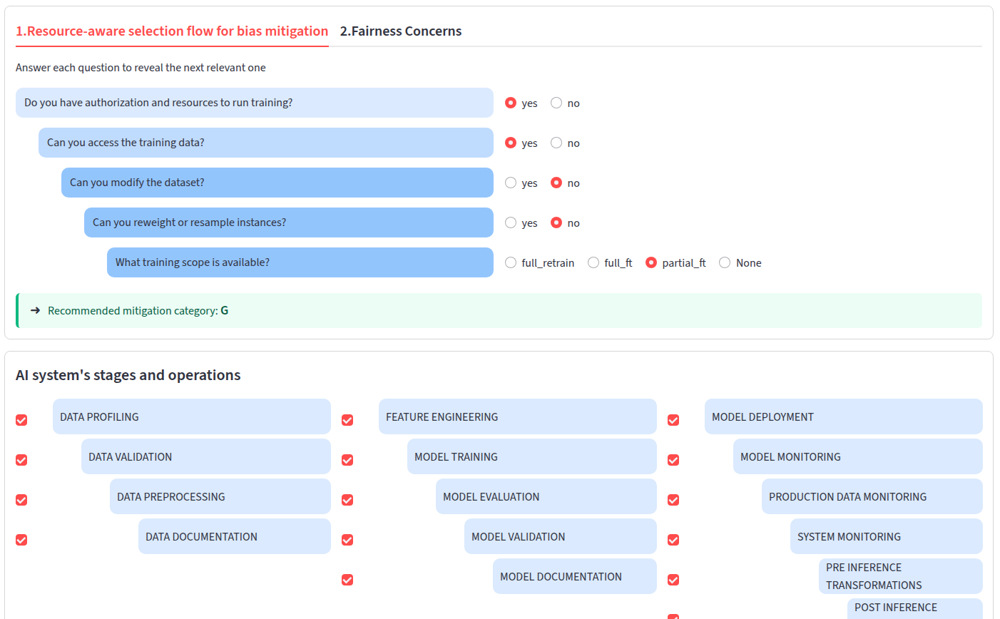
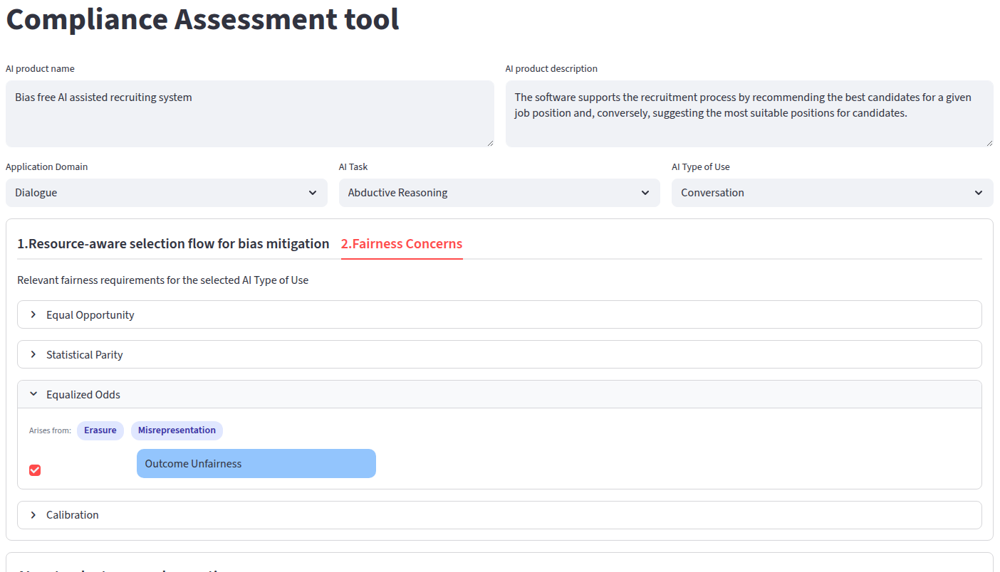

# aequitas-service
Decompose aequitas into a modular production-ready service.
This repo contains functionalities that wrap aequitas framework and its components into an end-to-end service to embed compliance into every operation of the AI lifecycle.

## Prerequisites

Before using this service, ensure the following are installed:

- **Python 3.10**

- **templops** — [MLOps framework library](https://github.com/AlbanaCelepija/enhanced_mlops)

- **aequitas-fairlib** — [Fairness library
  Documentation](https://pikalab-unibo-students.github.io/master-thesis-dizio-ay2324/)

## Running the GUI

From the repository root:

1. Install the GUI dependencies:
   ```bash
   pip install -r requirements.txt
   ```

2. Install the `temlops` library from the `framework` folder:
   ```bash
   pip install -e framework
   ```

3. Set the `FAIROPS_ONTOLOGY_PATH` environment variable to point to the `fairops.ttl` file of the [fairops ontology](https://github.com/ai-unibo/fairops/tree/main/docs). The GUI reads this variable to populate the interface (Application Domain, AI Task, AI Type of Use, Fairness Concerns, Notions, Metrics and Mitigation Techniques) from the ontology. `indiv.ttl` must live in the same folder as `fairops.ttl`, since it is loaded from there automatically.

   Copy `.env.example` to `.env` and fill in the path:
   ```bash
   cp .env.example .env
   ```
   ```bash
   FAIROPS_ONTOLOGY_PATH=/absolute/path/to/fairops/docs/fairops.ttl
   ```

4. Launch the Streamlit app:
   ```bash
   streamlit run gui/app.py
   ```

## GUI Overview

The Streamlit interface implements a **Compliance Assessment tool**. After entering the AI product name/description and selecting the Application Domain, AI Task, and AI Type of Use (populated from the fairops ontology), the tool exposes two tabs:

### 1. Resource-aware selection flow for bias mitigation

A guided questionnaire (authorization/resources, access to training data, ability to modify the dataset or reweight/resample instances, available training scope) that walks the user to a **recommended mitigation category**. Below it, the AI lifecycle stages and operations (data preparation, modelling, operationalization) are listed so the relevant ones can be selected.



### 2. Fairness Concerns

Based on the selected AI Type of Use, this tab lists the relevant fairness notions (e.g. Equal Opportunity, Statistical Parity, Equalized Odds, Calibration), each expandable to show the concerns it arises from (e.g. Erasure, Misrepresentation) and the associated fairness metrics to apply (e.g. Outcome Unfairness) and mitigation techniques (e.g. Reweighing).



